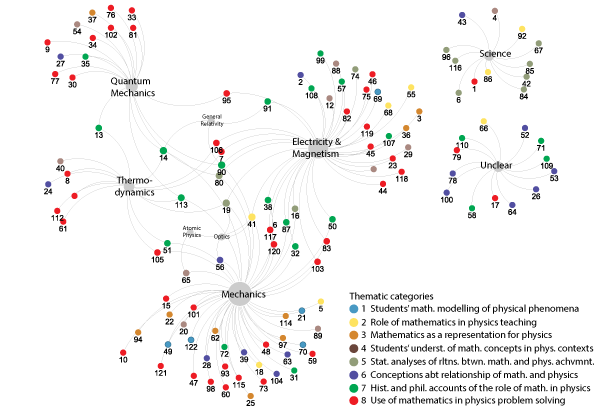

# roleMathInPhys
# Interactive Networks: Roles of Mathematics in Physics Education

This repository contains interactive network visualizations from the paper:

**Palmgren, E., Kokkonen, T., & Bruun, J. (2025). _Roles of Mathematics in Physics Education: A Systematic Review._**  
DOI: https://doi.org/10.1103/wwww-gwp8

We systematically reviewed 122 research articles to explore how mathematics is conceptualized in physics education research. Using network analysis, we visualized key patterns across article topics, theoretical frameworks, physics contexts, and roles of mathematics.

---

## 🔗 Interactive Network Visualizations

### **Figure 4: Physics Contexts × Articles**
  
🔍 _Which physics contexts (e.g., mechanics, E&M) were studied in each article_  
➡️ [Open interactive network](networks/context_network/index.html)

---

### **Figure 5: Theoretical Frameworks × Articles**
  
🔍 _Which theoretical frameworks were used in different studies_  
➡️ [Open interactive network](networks/framework_network/index.html)

---

### **Figure 6: Framework × Context Backbone Network**
  
🔍 _Strongest co-occurrence patterns between frameworks and physics contexts_  
➡️ [Open interactive network](networks/backbone_network/index.html)

---
### **Additional network: Theoretical Frameworks-Contexts Articles**
  
🔍 _Which heoretical frameworks as well as contexts were used in the reviewed literature_  
➡️ [Open interactive network](networks/backbone_network/index.html)

---
### **Gephi File**
[Download the Gephi project file](networks.gephi) (includes all nodes, edges, and layout used in the visualizations).
Find and install Gephi from [https://gephi.org](https://gephi.org). 

---

## 📄 Citation

> Palmgren, E., Kokkonen, T., & Bruun, J. (2025). _Roles of Mathematics in Physics Education: A Systematic Review._  
> DOI: https://doi.org/10.1103/wwww-gwp8

---

For questions, contact: [elina.palmgren@helsinki.fi](mailto:elina.palmgren@helsinki.fi)
